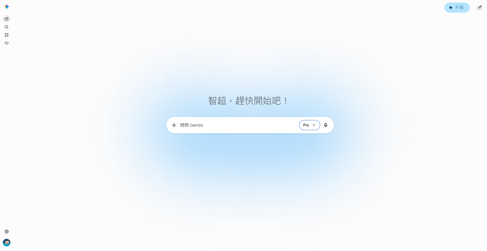
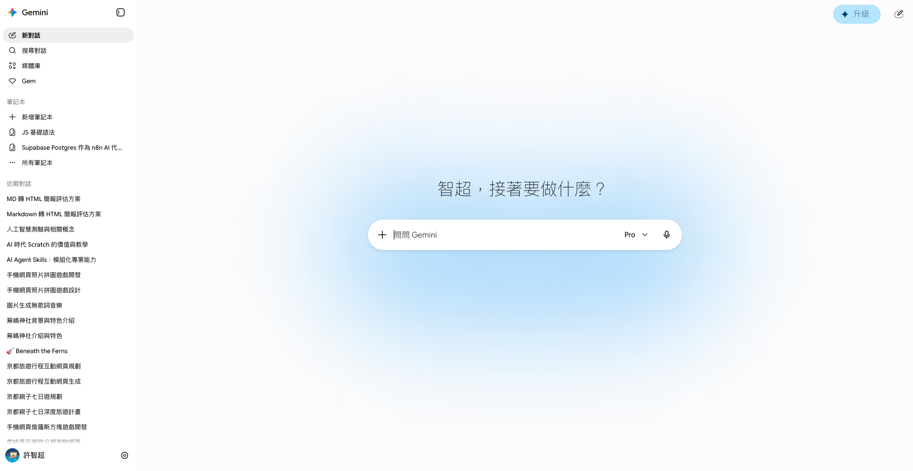
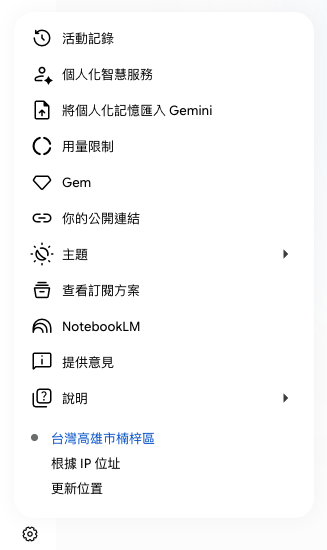
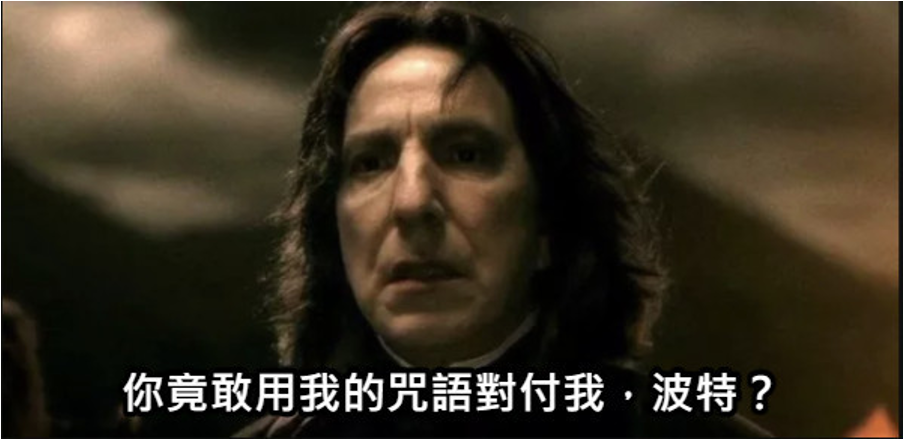
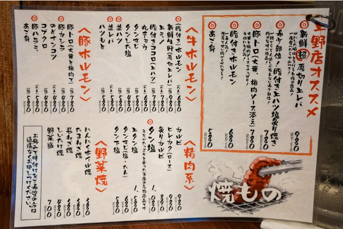

<!-- _class: cover -->
<!-- _paginate: false -->
<!-- _footer: "" -->

# 認識 Gemini
許智超

---

<!-- _class: section-page -->

<span class="num">01</span>

## 什麼是 Gemini？
<hr>

---
<style scoped>
section p, li { font-size: 0.8em; }
</style>

### Gemini
<hr>

Gemini 是 Google 開發的多模態大型語言模型 (LLM)，可處理文字、程式碼、圖片、音訊和影片等資訊。[https://gemini.google.com/](https://gemini.google.com/)
- 核心能力： 具備強大的**多模態**理解和推理能力，能夠同時處理並整合不同媒體格式的輸入。
- 主要優勢： 擅長複雜的推理和規劃，並能生成高品質程式碼。
- 應用整合： 廣泛內建於 Google 搜尋、Android 裝置及 Google Workspace 應用程式中。



---
<style scoped>
section p, li { font-size: 0.8em; }
</style>

### 介面
<hr>

- 左側邊欄（導覽與對話管理）
    - 頂部功能列：包含「新對話」、「搜尋對話」、「媒體庫」和「Gem」等快速連結。
    - 筆記本區塊：建立「新筆記本」，或存取既有專案，顯示了該介面支援結構化的知識管理。
    - 近期對話列表：下方列出了您過去的對話記錄，讓您能快速回顧或繼續之前的討論。
    - 個人資訊：顯示您的個人帳戶名稱及設定。
- 中央對話區（核心互動區域）
    - 輸入框：中央設有主要輸入框，允許您輸入文字進行提問。
    - 模型選擇與工具：輸入框右側標示目前使用的模型，並提供語音輸入圖示，方便您切換模型或選擇輸入方式。
- 右上角圖示
    - 右上角設有「無痕對話」的圖示，讓您以無痕模式進行對話。



---
<style scoped>
section p, li { font-size: 0.8em; }
</style>

### 設定
<hr>

- 個人化與帳戶管理
  - 活動記錄：查看或管理您的對話互動歷程。
  - 個人化智慧服務：針對您的需求優化 AI 體驗。
  - 將個人化記憶匯入 Gemini：讓 AI 能參考與您相關的資訊，提升對話的精確度與連續性。
- 應用與工作流整合
  - Gem：管理或自定義您的專屬 AI 助手。
  - NotebookLM：快速存取該筆記工具，方便處理與研究相關的複雜文件。
  - 你的公開連結：管理您分享出去的對話連結。
- 系統與偏好設定
  - 用量限制：監控您目前使用模型的額度狀況。
  - 主題：可調整介面的顯示外觀。
  - 說明與意見回饋：存取說明中心或是向開發團隊提供使用體驗建議。



---

<!-- _class: section-page -->

<span class="num">02</span>

## Gemini 初體驗
<hr>

---

### 和 Gemini 互動
<hr>

- 什麼是提示詞 (Prompt)？
提示詞是您與 Gemini 互動的主要方式，透過文字輸入，您可以向模型提出問題、請求建議或要求生成內容。
- 要具備什麼能力才能和 Gemini 互動？
會講話就可以了
- 第一個練習：
請 Gemini 幫你寫一封電子郵件，內容是邀請同事參加下週的專案會議，並附上會議時間與地點。

---

### Gemini 說得都對嗎？

---

### 語言模型大比拼，誰說得最正確？

- Gemini：<https://gemini.google.com>
- ChatGPT：<https://chat.openai.com>
- Claude：<https://claude.ai>
- Perplexity：<https://www.perplexity.ai>
- Grok：<https://grok.com>
- DeepSeek：<https://www.deepseek.com>
- Qwen：<https://chat.qwen.ai>
- Doubao：<https://www.doubao.com>

---

### 語言模型大比拼，誰說得最正確？

- 任務一：
- 任務二：
```
冰塊最想做什麼事？
```
```
老王姓什麼？
```
```
很熱的島是什麼島？
```

---

### 真的只要會講話就可以用 Gemini 嗎？

---

### 秘訣：把 Gemini 當成你的個人小助理

---

<style scoped>
section p { text-align: center; }
</style>

### 把 Gemini 當成你的個人小助理


---

<style scoped>
section p { text-align: center; }
</style>

### 把 Gemini 當成你的個人小助理


---


### 看看別人的提示詞怎麼寫


---

### 提示詞

**提示詞（Prompt）** 是你與 AI 模型（如 Gemini）溝通時所輸入的文字、指令或問題。它是引導 AI 產生特定輸出結果的「鑰匙」。

簡單來說，你可以把 AI 想像成一個博學但需要明確指示的助手，而提示詞就是你給予助手的**具體工作說明書**。

---

### 為什麼提示詞很重要？

提示詞的精確程度，直接決定了 AI 回答的品質。就像在職場中：

* **模糊的指示**（例如：「寫一份報告」）：AI 可能會給出過於籠統、不符合你需求的內容。
* **精確的指示**（例如：「請以專業的語氣，為我寫一份關於 2026 年台灣電動車市場趨勢的分析報告，重點包含成本效益與未來五年預測，字數控制在 1000 字以內」）：AI 能更精準地提供你真正需要的資訊。

---

### 一個優質的提示詞通常包含哪些元素？

要寫出好的提示詞，建議你可以遵循 **「結構化思維」**，包含以下幾個要素：

1. **角色設定 (Role)**：告訴 AI 它現在是誰。（例如：「你是一位專業的行銷顧問」）
2. **背景資訊 (Context)**：提供必要的背景知識。（例如：「我正在為一家新創咖啡廳規劃社群經營策略」）
3. **具體任務 (Task)**：清楚說明你要做什麼。（例如：「請幫我撰寫三篇 Instagram 的貼文文案」）
4. **格式限制 (Format/Constraints)**：說明你希望輸出的呈現方式。（例如：「請使用條列式呈現，語氣要輕鬆活潑，並附上適合的表情符號」）

---

### 舉例說明

* **普通提示詞**：
> 「教我做蛋糕。」


* **優化後的提示詞**：
> 「你是一位資深的烘焙師傅。請教我如何在家製作基礎的戚風蛋糕。請提供詳細的食材清單、清楚的步驟說明，並特別列出兩個新手最容易失敗的環節及解決方法。請以簡潔易懂的文字呈現。」

---

### 實用小撇步

* **給予範例**：如果你希望輸出的風格符合特定格式，可以在提示詞中附上一個範例（Few-shot Prompting）。
* **迭代優化**：如果 AI 第一次給的結果不滿意，不需要重寫整段話，直接對它說「請將語氣調整得更正式一點」或是「請針對第二點補充更多細節」，AI 會根據對話脈絡進行調整。
* **分步驟引導**：對於複雜的任務，可以要求 AI 「請一步一步思考（Chain of Thought）」，這能顯著提升 AI 在邏輯推理或程式開發任務上的精確度。

---

<!-- _class: section-page -->

### 提示詞很難？用魔法打敗魔法



---

<!-- _class: section-page -->

## Gemini 來畫圖

---

<!-- _class: compare -->

<div><br /><br /><br />

### 以文生圖

根據輸入的文字描述，自動生成一張圖片。
</div>

<div><br /><br /><br />

### 以圖生圖

根據給定的圖片，自動生成另一張新的圖片。仍然需要文字描述來指定想要的修改或風格。
</div>

<div><br /><br /><br />

### 以圖生文

根據圖片，自動生成描述文字、故事、說明或其他形式的文字內容。
</div>


---

<style scoped>
section h3, p { text-align: center; }
</style>

<!-- _class: quad -->

<div><br /><br />


### 圖卡用途
做什麼用途？要給誰？
</div>
<div><br /><br />


### 視覺風格
插畫？水彩？可愛風？3D？

</div>
<div><br /><br />


### 畫面元素
禮物、氣球
花束、人物
燈光、背景

</div>
<div><br /><br />


### 構圖方式
橫式？直式？
中心構圖？留白空間？
</div>

---

### 以文生圖

提示詞：
> 一張中秋節賀卡，送給全家人。水墨插畫風格，色調以深藍、金色與橙色為主。畫面中央是一輪圓滿的金色明月，月下有一家人圍坐賞月，桌上擺著月餅與燈籠，背景是深藍夜空與銀色雲霧。橫式構圖，家人群像置中，上方留白可書寫「中秋快樂」祝福語。

---

<style scoped>
section p { text-align: center; font-size: 0.5em; }
</style>

### 以圖生圖：修復老照片、變彩色、變風格


[張哲生FB貼文](https://www.facebook.com/ZhangZheSheng/posts/40%E5%B9%B4%E5%89%8D%E9%96%8B%E5%B9%95%E4%BD%8D%E6%96%BC%E9%AB%98%E9%9B%84%E5%B8%82%E4%BA%94%E7%A6%8F%E4%BA%8C%E8%B7%AF%E8%88%87%E4%B8%AD%E5%B1%B1%E4%B8%80%E8%B7%AF%E5%8F%A3%E7%9A%84%E8%88%8A%E5%A4%A7%E7%B5%B1%E7%99%BE%E8%B2%A8/10153097296119531/)

---

<!-- _class: compare -->

<div>

### 修復老照片

> 請修復這張老照片：移除刮痕、污漬和褪色痕跡，補強模糊區域的細節，讓畫質接近現代數位照片，但保留照片原本的構圖與人物面貌，不要改變內容。
</div>

<div>

### 黑白照片變彩色

> 將這張黑白老照片自動上色，根據照片拍攝年代（約1960年代台灣）推測合理的色彩配置，皮膚、服裝、背景環境都要自然著色，呈現出真實感而非卡通風格。
</div>

<div>

### 變風格

油畫風：將這張照片轉換成印象派油畫風格，筆觸明顯、色彩鮮豔飽和，光影對比強烈，保留原本人物與場景的構圖。
水彩風：將這張照片改成水彩畫風格，色彩透明輕盈、邊緣柔和，有留白感，像手繪插畫。
動漫風：將這張人物照片轉換成日式動漫插畫風格，保留人物特徵，眼睛放大、線條簡化，背景可以做成動漫場景感。
</div>


---

<style scoped>
section p { text-align: center; font-size: 0.5em; }
</style>

### 以圖生圖：換服裝、換背景、換風格


[鄧麗君](https://tcmb.culture.tw/zh-tw/detail?keyword=%E9%84%A7%E9%BA%97%E5%90%9B&limit=24&offset=168&sort=relevance&order=desc&isFuzzyMode=false&query=%7B%7D&indexCode=online_metadata&id=2305084&recOffset=179)

---

<!-- _class: compare -->

<div>

### 換服裝

> 請將照片中人物的服裝換成西裝，保留人物的臉部特徵、髮型與姿勢，只替換衣物部分，讓整體看起來自然真實。

</div>

<div>

### 換背景

> 請將照片背景替換成日本京都秋天的街道，保留前景人物不變，背景光線與色調要與人物融合自然，不要有合成感。

</div>

<div>

### 換風格

古典油畫：將這張人物照片轉換成文藝復興時期油畫風格，保留人物構圖，背景改為暗色調畫布質感。
賽博龐克：將照片改成賽博龐克風格，霓虹燈光打在人物身上，背景換成未來都市夜景，色調偏藍紫色。
漫畫分鏡：將照片轉換成美式漫畫風格，線條粗獷、色塊平塗，加上網點效果。

</div>

---

<style scoped>
section p { text-align: center; font-size: 0.5em; }
</style>

### 以圖生文：自動生成圖片內容及說明文字


[請問有懂日文的人，可以幫翻譯菜單嗎？](https://www.dcard.tw/f/japan_travel/p/257247851)

---

### 以圖生文：自動生成圖片內容及說明文字

> 幫我辨識圖中的日文，並整理成表格，表格有四個欄位，分別是日文、中文、日元及台幣

---

<!-- _class: section-page -->

## 試試 ChatGPT 的繪圖

---


